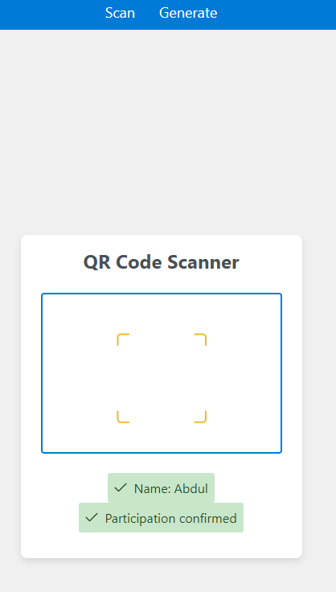
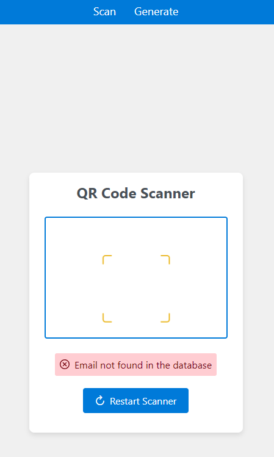

# QR-Ticket System

## Functionality
This web application generates and scans secure QR codes using a secure encryption algorithm called "aes-256-cbc".

- **Generation**: From the email address, an unintelligible text is created, which is then converted into a QR code using the JavaScript library "qr-scanner".
- **Database**: The information is stored in a MongoDB to prevent data loss. The data structure is as follows:

| Email             | Name           | Participated    |
|-------------------|----------------|------------------|
| asd@gmail.com     | Max Mustermann  | true             |

## Images
1. **Main Page**
   

2. **Generator Page**
   

3. **Scan of Valid Guest QR Code**
   

4. **Scan of Already Scanned Valid Guest QR Code**
   

5. **Scan of Invalid Guest QR Code**
   
