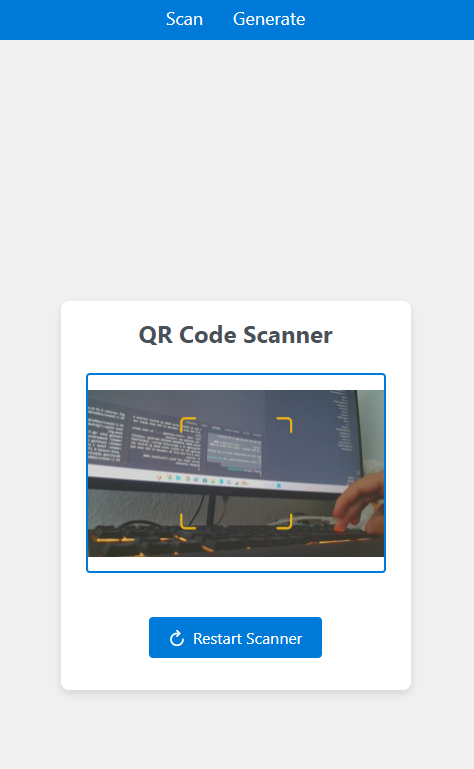
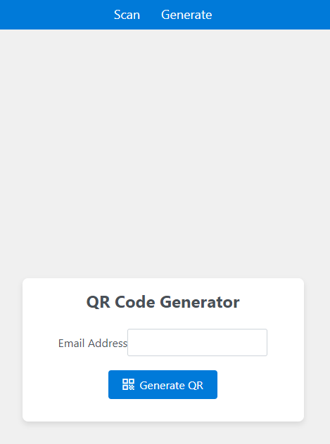
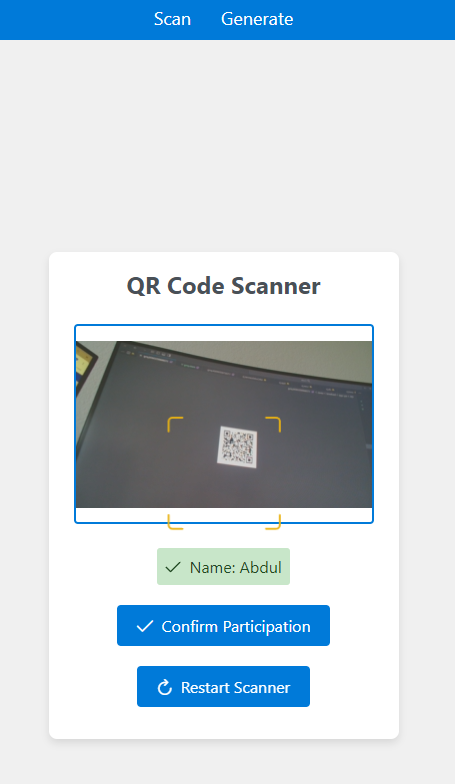

# QR-Ticket-System

## Funcionality
This web app generate and scan a secure QR Code with help of an secure encryption algorithm "aes-256-cbc".
- It generates out of the Mail adress an Human ununderstandable Text which will be coverted to QR Code with help of the js library "qr-scanner".
- The data will be stored in a mongoDatabase to avoid loss of the data with the following structure:
| email | name | participated |
|-------|------|--------------|
| asd@gmail.com | Max Mustermann | true |

Pictures:
1. Main Page

2. Generator Page

3. scan of valid Guest QR Code

4. scan of already scanned valid Guest QR Code

5. scan of not valid Guest QR Code

